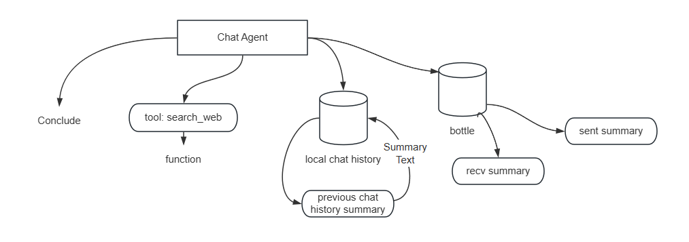
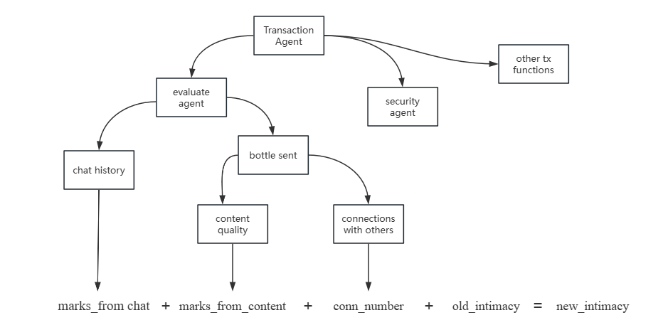

# Omni-Agent Design Document

## Introduction

The agent we developed appears as a single "bartender" role from the user's perspective. However, it is actually a multi-agent system composed of several different agents working together.

This project is built on OpenAI's Swarm framework, an open-source and lightweight multi-agent collaboration framework that makes it easy for developers to quickly develop agents.

From a code perspective, the Agent side runs on two different runtimes: one is the `python runtime`, and the other is the `node runtime`. The Python runtime is responsible for making various decisions and operations for the agents, even interacting with the Nillion database (for details on how we use Nillion, please refer to the section below). On the other hand, the Node runtime is responsible for handling transactions (such as interacting with smart contracts). Below, we will explain both runtimes separately:

## Python Runtime

Our agent has various functionalities, including token issuance, NFT creation, dynamic evaluation of user-agent intimacy, and the quality of user text. To meet these needs, we developed the **Evaluate Agent**, **Transaction Agent**, **Chat Agent**, and other utility functions. In consideration of transaction security, we will introduce the **Security Agent** in the future, which will handle encryption for transactions.

### Agent Composition

#### 1. **Evaluate Agent**
The responsibility of the Evaluate Agent is to calculate the user's intimacy score based on their chat history and message bottle content. This agent utilizes the following functions:

- `grade_sent_bottles()`: Scores the content of the sent message bottles.
- `grade_chat_history()`: Scores the user's chat history.
- `compute_new_intimacy()`: Computes the new intimacy score based on the evaluation.

Evaluation Criteria:

- **Depth**: Check whether the chat content reflects deep thoughts or emotions.
- **Articulation**: Evaluate whether the chat is expressed in a thoughtful and proper manner.
- **Extraordinary Ideas**: Evaluate whether the chat contains unique insights or innovative thinking.
- **Mediocrity**: Lower the score for content that lacks depth or substance.

#### 2. **Transaction Agent**
The Transaction Agent is responsible for handling transactions. It interacts with external services via the following functions:

- `call_faucet()`: Calls the local Faucet contract to transfer tokens.
- `call_NFT()`: Calls the local NFT contract to create a new NFT.
- `compute_token_amount()`: Calculates the number of tokens to be transferred based on the new intimacy score.

#### 3. **Chat Agent**
The Chat Agent is responsible for conversing with the user. Before engaging in a conversation, it first evaluates the user's persona, inner needs, and desires. This assessment is used as a prompt, along with the user's chat content, to enhance the LLM's (Large Language Model) generation for a more tailored response. It mainly uses the following two functions:

- `launch_summary()`: Evaluates and analyzes the user's psychological state, persona, and inner needs based on prior chat history and message bottle content.
- `search_web()`: When the user's question cannot be answered by the LLM, it queries a search engine to gather relevant information.

### Agent Token Issuance Flow
To incentivize and reward users, the agent dynamically determines the amount of tokens to be issued based on the user's chat content, chat frequency, and message bottle quality. This feedback mechanism aims to encourage user engagement.

The agent will:

1. call `Evaluate Agent` to evaluate the user's scores, based on his/her chat history and message bottle content.
2. (Optional) call `Security Agent` to check the scores are valid or not, check if there is cheating prompt or behavior from user.
3. Operate transactions by using the trasaction functions.

And, these functions are simply sending requests to `node runtime` expressa service. In this way, we solve the problem of the language gap.

> We are considering introduce **Chain of Thinking** into our agentic program, to make the agent more intelligent and engaging.

## Node Runtime

The Node runtime is rather simple. It is responsible for handling transactions and interacting with the smart contracts. It has the following api endpoints:

+ `/api/tx/faucet`: This endpoint is used to transfer tokens to the user's wallet.
+ `/api/tx/nft`: This endpoint is used to create a new NFT.

Our contract is deployed on testnet, to see our contract implementation, please refer to the `smart_contract` git branch.

## How we use Nillion

To store user's secret data and ensure privacy, we decide not to store them on the backend database, instead we store them on nillion's SecretVault.

To understand how to get hands on with it, please refer to the README.md file in `agent.py_runtime` directory.

To point out, we use nillion's Secret Vault in two places:

1. `fetch_sent_bottles_sync` function for Evaluate Agent, to fetch the user's sent message bottles. See implementation in `function_impl/fn_evaluate.py` file.
2. `fetch_sent_bottles` function for Chat Agent, to fetch the user's sent message bottles. See implementation in `function_impl/fn_summary.py` file.

To store imformation, we often do it manually: see `2.upload_some_info.py` in `agent.py_runtime/` directory, besides, before the server shuttiing down, we will store all the cached data into the nillion's Secret Vault.

__Why store user's bottles content on nillion's Secret Vault?__

- To ensure privacy, we do not store user's bottles content on the backend database. We do not want to expose user's private data to the backend server. And make user feel safe.
- Data security: in case that some secret of user's content will be leaked, nillion is the best choice.

__Why not other data, like chat history?__

- The very first point is: The privacy of user's chat history is less important than the privacy of user's bottles content. The user may do not want to share secrets with agent, but they will choose to write secrets in their bottles.
- The chat history is usually very long, and it is not suitable to store it on the nillion's Secret Vault.